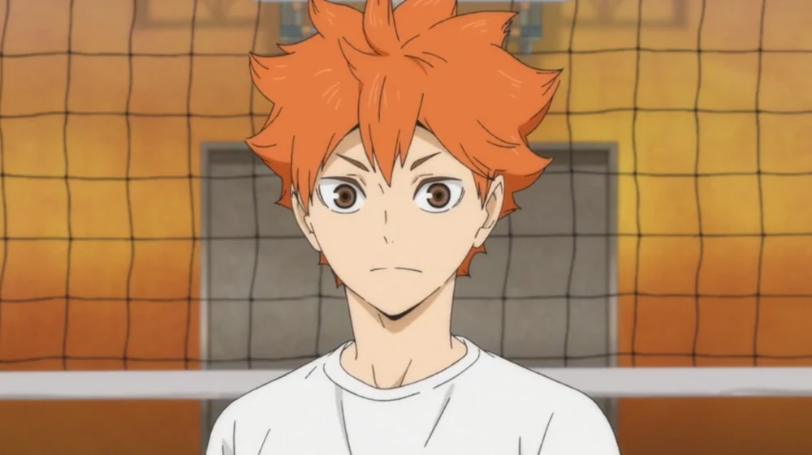

           <!-- card end-->
           

              

                  

                       
                  

              

                 

                    <h2 class="card-title">Shōyō Hinata</h2>
                     

                        Shōyō Hinata is the main protagonist of the Haikyuu!! series written and illustrated by Haruichi Furudate. He is a first year student at Kurasuno High School and joined the Volleyball team, becoming a middle blocker.
                     

                

             

           

         

       <!--card end-->
